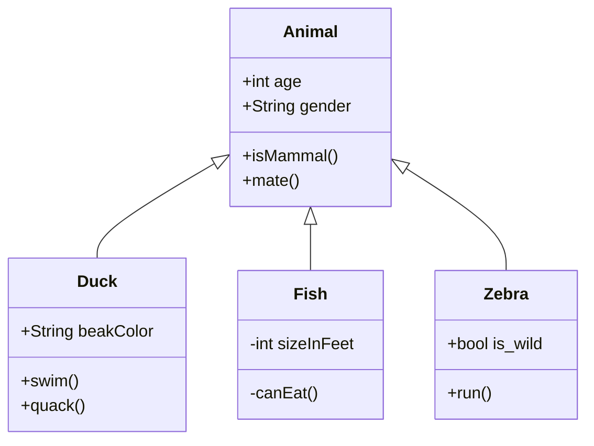
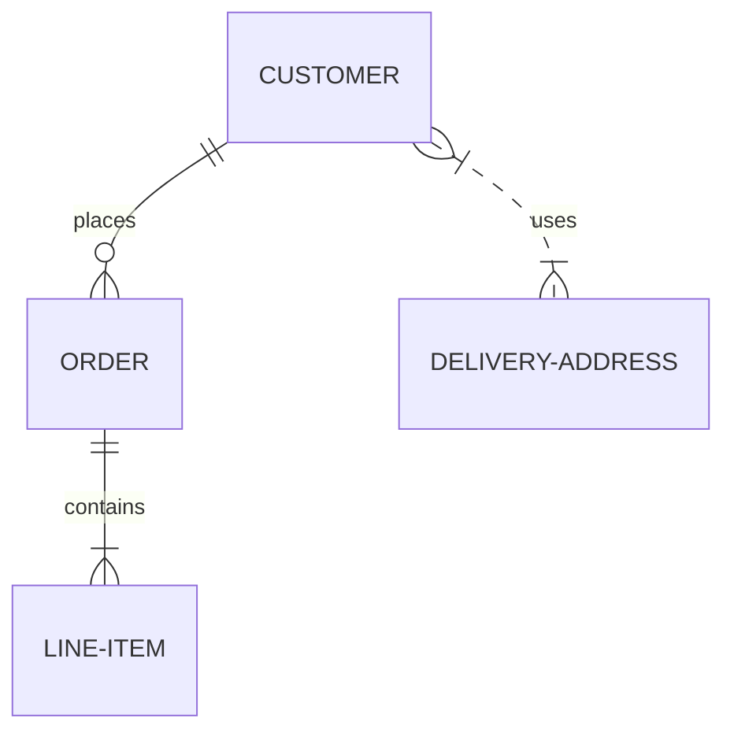
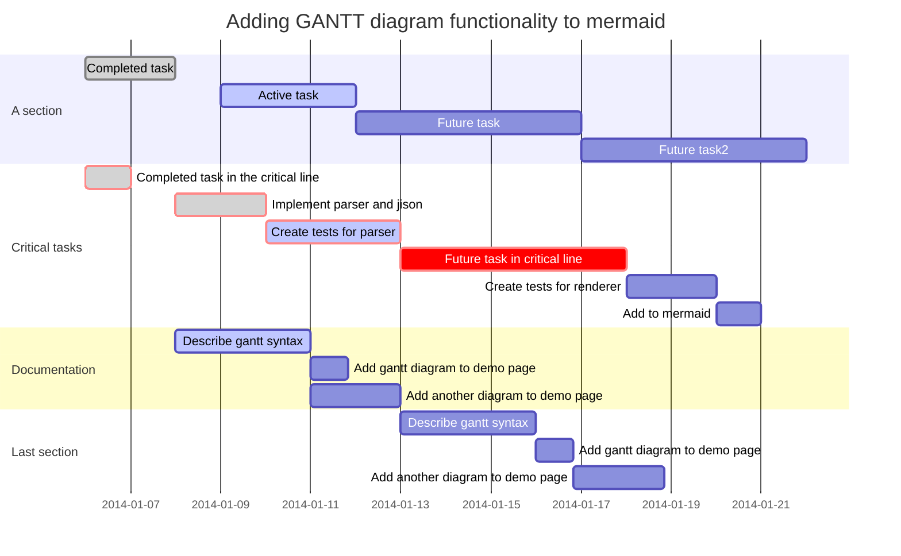
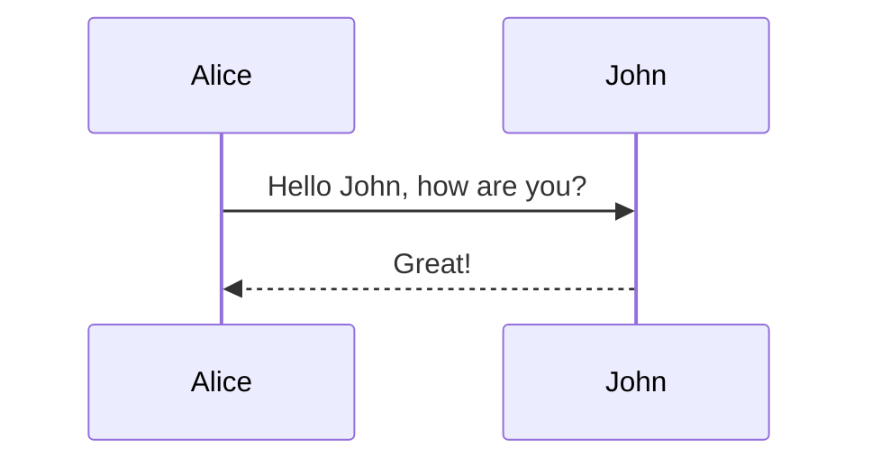

## mermaid記法まとめ

なお描画された図の結果は下記の gist を参照されたし。

<https://gist.github.com/toshimaru/1c85d6a7dc002663e27d39af220b3225>

## クラス図 (Class Diagram)

## ER図 (ER Diagram)

## ガントチャート (Gantt Chart)

## フローチャート (Flowchart)

## シーケンス図 (Sequence Diagram)

