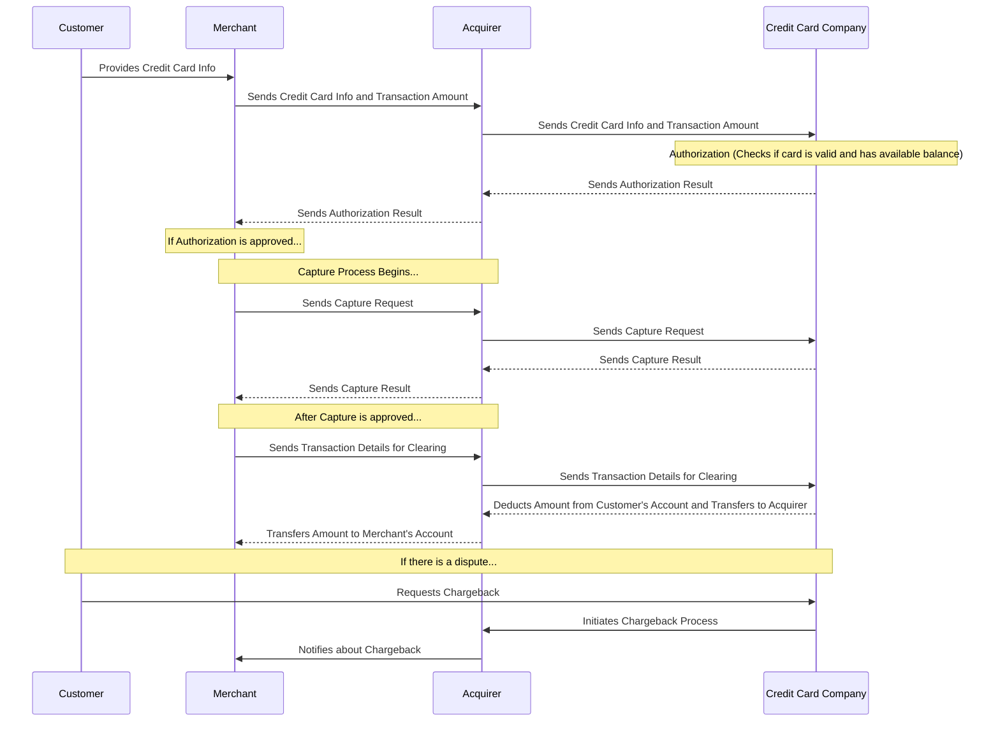

ChatGPT にクレジットカードの取引フローを mermaid で書かせてみた。

> クレジットカードの取引のフローを、オーソリ（Authorization）、キャプチャ（Capture）、クリアリング（Clearing）、そしてチャージバック（Chargeback）の流れでMermaidを用いて描写すると次のようになります：

## mermaid

## 図

<pre class="mermaid">

sequenceDiagram
    participant Customer as Customer
    participant Merchant as Merchant
    participant Acquirer as Acquirer
    participant CreditCardCompany as Credit Card Company

    Customer->>Merchant: Provides Credit Card Info
    Merchant->>Acquirer: Sends Credit Card Info and Transaction Amount
    Acquirer->>CreditCardCompany: Sends Credit Card Info and Transaction Amount
    Note over CreditCardCompany: Authorization (Checks if card is valid and has available balance)
    CreditCardCompany-->>Acquirer: Sends Authorization Result
    Acquirer-->>Merchant: Sends Authorization Result
    Note over Merchant: If Authorization is approved...

    Note over Merchant,Acquirer: Capture Process Begins...
    Merchant->>Acquirer: Sends Capture Request
    Acquirer->>CreditCardCompany: Sends Capture Request
    CreditCardCompany-->>Acquirer: Sends Capture Result
    Acquirer-->>Merchant: Sends Capture Result

    Note over Merchant,Acquirer: After Capture is approved...
    Merchant->>Acquirer: Sends Transaction Details for Clearing
    Acquirer->>CreditCardCompany: Sends Transaction Details for Clearing
    CreditCardCompany-->>Acquirer: Deducts Amount from Customer's Account and Transfers to Acquirer
    Acquirer-->>Merchant: Transfers Amount to Merchant's Account

    Note over Customer,CreditCardCompany: If there is a dispute...
    Customer->>CreditCardCompany: Requests Chargeback
    CreditCardCompany->>Acquirer: Initiates Chargeback Process
    Acquirer->>Merchant: Notifies about Chargeback

</pre>

