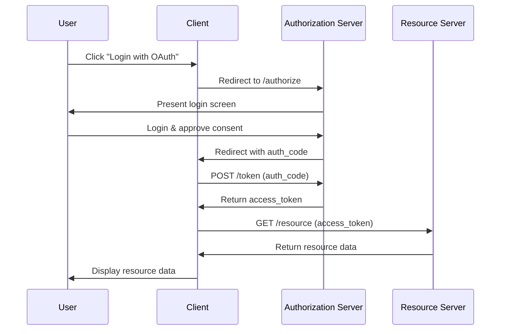

## OAuth2.0 Flow

<pre class="mermaid">
sequenceDiagram
    participant User as User
    participant App as Client
    participant Auth as Authorization Server
    participant Resource as Resource Server

    User->>App: Click "Login with OAuth"
    App->>Auth: Redirect to /authorize
    Auth->>User: Present login screen
    User->>Auth: Login & approve consent
    Auth->>App: Redirect with auth_code
    App->>Auth: POST /token (auth_code)
    Auth->>App: Return access_token
    App->>Resource: GET /resource (access_token)
    Resource->>App: Return resource data
    App->>User: Display resource data

</pre>

## Google の場合

ref. [Using OAuth 2.0 to Access Google APIs  \|  Authorization  \|  Google for Developers](https://developers.google.com/identity/protocols/oauth2)

## OAuth 2.0 vs OpenID Connect

下記の動画がわかりやすかった。

<iframe width="560" height="315" src="https://www.youtube.com/embed/PKPj_MmLq5E?si=Tw06XUkdcvmYNAqM&amp;start=752" title="YouTube video player" frameborder="0" allow="accelerometer; autoplay; clipboard-write; encrypted-media; gyroscope; picture-in-picture; web-share" allowfullscreen></iframe>
